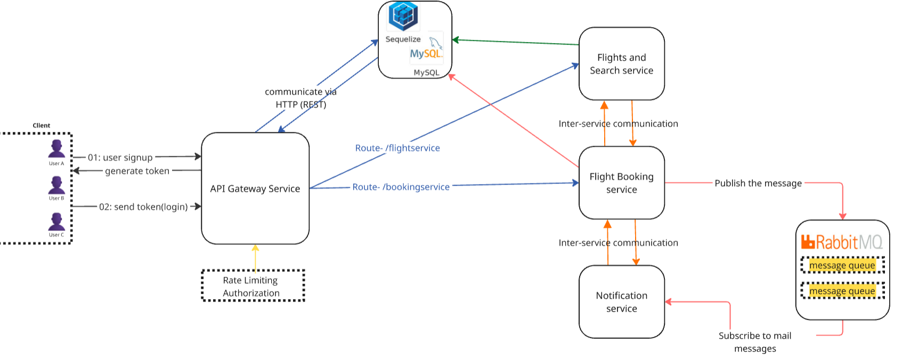
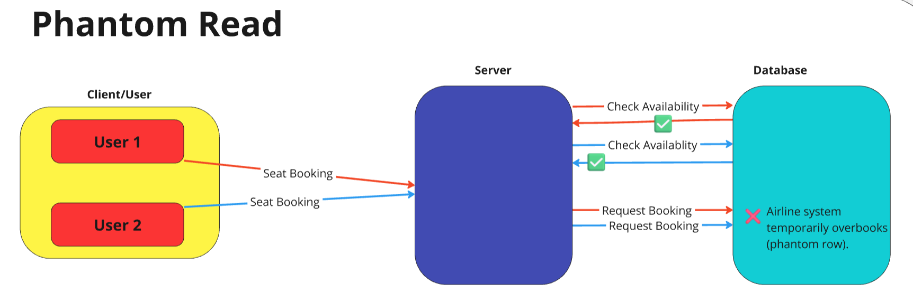
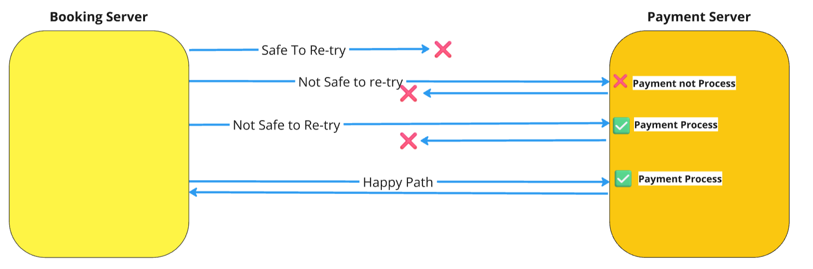

# Flight Booking System

The modern airline industry faces critical challenges—double bookings, payment failures, and last-minute seat conflicts—leading to frustrated passengers and revenue losses for airlines.

Instead of just building a simple booking system, we focused on understanding and solving these issues using well-defined optimistic and pessimistic booking strategies, ensuring idempotent payments, and preventing race conditions when the last seat is booked.

## Documentation

You can explore the detailed design and code documentation below:

- [Detailed Design and Code Doc](https://docs.google.com/document/d/1JCH41-1cRlfE5Qo2_oDjnwRLJXbYDAZT8AQJtBJNVGk/edit?usp=sharing)

## Table of Contents

- [System Architecture](#system-design--flight-booking-microservices-architecture)
- [Key Engineering Problems](#engineering-challenges-addressed)
- [Tech Stacks](#technology-stack)
- [Features](#features)
- [Services](#services)
- [Installation](#installation)

## System Design – Flight Booking Microservices Architecture



## Engineering Challenges Addressed

This project tackles three key engineering challenges:

1. **Eliminating Concurrent Booking Conflicts:** We developed a robust solution to prevent double-booking of seats during periods of high demand. Our system accurately allocates seats based on a prioritized approach (pessimistic locking), ensuring fairness and preventing frustrating user experiences where multiple users believe they've successfully booked the same seat. This is particularly crucial during peak booking times and significantly improves user satisfaction.
   
   

2. **Preventing "Last Seat" Double-Bookings:** A critical failure point in flight booking systems involves the simultaneous booking attempts for the final remaining seat. Without proper locking mechanisms, both users could receive booking confirmations, leading to a system inconsistency and requiring manual intervention for refunds and customer support. This project implements a robust solution to prevent this scenario, ensuring that only one user is allocated the last seat.
   
   
   

3. **Ensuring Reliable and Idempotent Payment Processing:** We've built a payment gateway integration that is completely idempotent. This ensures that regardless of network hiccups or repeated requests, payments are processed correctly only once, maintaining data integrity and preventing financial errors. This robust design significantly reduces the risk of financial discrepancies and customer disputes.
   
   

## Technology Stack

- **Backend:** Node.js with Express.js
- **Database:** MySQL with Sequelize ORM
- **Message Queue:** RabbitMQ (used in Notification services for asynchronous communication with amqplib library)
- **Proxy:** Http-Proxy with Http-rate-limit
- **Auth:** Bcrypt with Jsonwebtoken
- **Other Libraries:** Axios (HTTP client), Winston (logging), dotenv (environment variables)

## Features

- It is developed on the Microservice Architecture.
- Implemented JWT Token authentication mechanism for authentication and authorisation of users.
- Implemented API Gateway which authenticates thetoken and also apply Rate Limiting does which basically works as an Reverse Proxy and helps in preventing Dos Attacks.
- Implemented Caching(Cache Aside Pattern) in the Flights Search Serviceusing Redis there by optimizing the response time.
- Implemented CronJobs in Remainder Service which automatically delete the already sent emails to the customers and automatically sends an email to customer.
- Implemented interservice synchronous communication using HTTP(REST)APIs and also asychronous communication using Message Brokers like RabbitMQ.

## Services

This project is composed of several microservices:

- **Flight Repo:** Manages flight data, including schedules, seat availability, and pricing. It handles user flight searches and filters based on criteria, ensuring accurate flight information.
  - [Link to Flight Search Service Repo](https://github.com/Vkpro55/Flight-and-Search-Service)
- **Booking Service:** Handles core booking logic, including seat availability and reservation.
  - [Link to Booking Service Repo](https://github.com/Vkpro55/Flight-Booking-Service)
- **Flight API Gateway:** Acts as a single entry point for all client requests.
  - [Link to Flight API Gateway Repo](https://github.com/Vkpro55/API-Gateway_flights)
- **Notification Service:** Manages flight booking confirmations and other notifications.
  - [Link to Notification Service Repo](https://github.com/Vkpro55/Airline-Notification-Service)

## Overview of Src folder for Developers

Here’s a brief overview of the "src" folder structure:

- config: Setups for libraries and modules, e.g., "dotenv" for environment variables.
- routes: Registers routes, middlewares, and controllers.
- middlewares: Handles interceptors for validations, authentication, etc.
- controllers: Contains business logic for routes, structures API responses.
- repositories: Interacts with the DB using raw or ORM queries.
- services: Contains business logic and communicates with repositories.
- utils: Helper methods, error classes, and utility functions.

## Installation

- Clone the repository

  `bash`

  ```
  git clone https://github.com/Vkpro55/Node.js-03.git
  ```

- Install Install Dependencies

  `bash`

  ```
  npm install
  ```

- Create .env file in root directory

  `.env`

  ```
  PORT=3000 || 4000 || 8000
  ```

- Configure Sequelize ORM with Sequelize-CLI and MySQL Database

  `run`

  ```
  npx npx sequelize init
  ```

  ```
  {
   "development": {
     "username": "root",
     "password": "root_password",
     "database": "database_name",
     "host": "host_url",
     "dialect": "mysql"
   },
   "test": {
     "username": "root",
     "password": null,
     "database": "database_test",
     "host": "127.0.0.1",
     "dialect": "mysql"
   },
   "production": {
     "username": "root",
     "password": null,
     "database": "database_production",
     "host": "127.0.0.1",
     "dialect": "mysql"
   }
  }

  ```

## Important Note: Build Your Own Version

Do not copy the project directly. If you want to build your own version, start by thoroughly reading the documentation. Understand the architecture and functionality before implementing your own version. This will help you build a customized solution that aligns with your learning goals and requirements.
